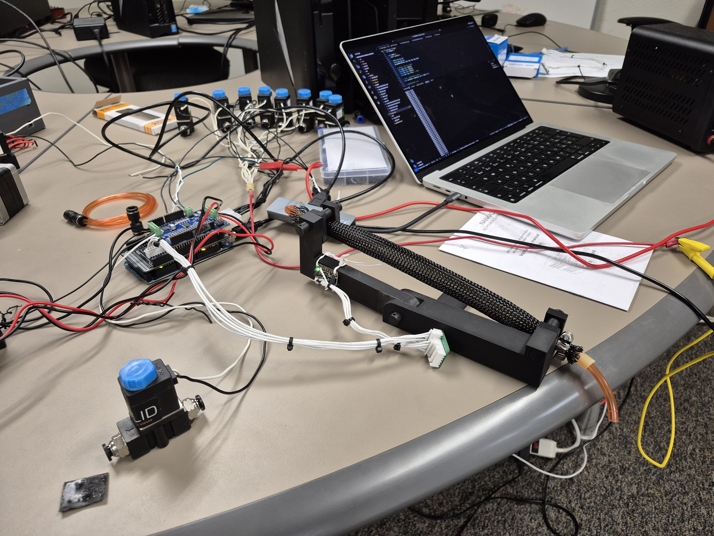
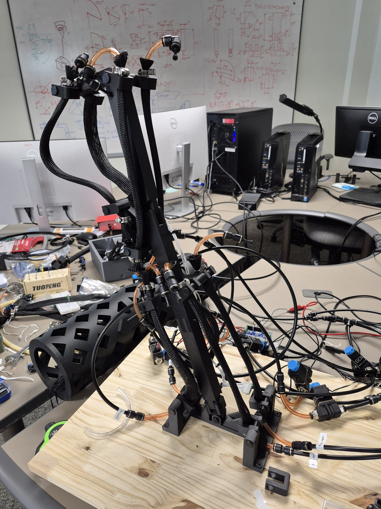

# Lower-leg exoskeleton control and test software
Software used for tests regarding precision of angle control with pneumatical artificial muscle (PAM) for lower-leg exoskeleton proof of concept test stand.
System allows to control each PAM on it's own or just set targeted angle let it do its thing to get to target.

Software can increase or decrease pressure gradually for each muscle.

Targeting algorithms can operate with one muscle where the opposing force is gravity, you can see example in test stand V1 CAD files.
System can also operate with antagonistic muscles in one degree of freedom (DOF) or two DOFs, you can see example in test stand V2 files.

## Table of Contents

## Hardware
Following hardware was utilized with the control software:
- Electronics
  - Arduino Mega 2560 Rev 3
  - 2 MPU6050 as IMUs
  - Adafruit Motor Shield V2 to open and close solenoid valves
  - 12V, 1.2A external power supply for solenoids
    - it should handle up to 6 solenoids open
  - 10 12V, 540mA solenoid valves
- Pressure system
  - 60psi air supply
  - fuel line tubing used for air pressure routing
- Pneumatic Artificial Muscles
  - 3/4" PET expandable braided sleeve
  - 1/4" inner diameter tubing forming the air chamber
  - clamps sealing the tube, sleeve and fuel line together

### Test stand V1
First version of test stand can be used for test up to two non-antagonistic PAMs that should have 10 inches of expandable area. Tests with this stand should be done with `t70` or `t-dyn` commands which are going to be described in more detail in [functions section](#functions).
Fusion 360 CAD model can be found in [repository](docs/test-stand-v1/cad-files/test_stand_v1.f3d):

[Here is demo of test stand](docs/test-stand-v1/test_stand_v1_run.mp4)

### Test stand V2
Second version test stand is suitable for antagonistic muscle tests with 1 DOF to 3 DOFs.
For these tests you want to utilize this commands which will be described in [functions section](#functions): `t-ant-dyn`, `t-ant-dyn-2-dof`or `t-ant-dyn-2-dof-v2`.
Fusion 360 CAD models can be found in [repository](docs/test-stand-v2/cad-files):

[Here is demo of test stand](docs/test-stand-v1/test_stand_v1_run.mp4)

## System startup procedure
When software is not ready on micro-controller yet: 
1. Open code in Visual Studio Code
2. Install PlatformIO extension
3. Connect microcontroller to computer
4. Flash micro-controller with software through PlatformIO
5. Continue with [these steps](#when-software-is-already-on-micro-controller)

### When software is already on micro-controller
This is the startup procedure that one should adhere in order to start the system correct way:
1. Connect microcontroller to computer
2. Open monitor in Visual Studio Code extension PlatformIO
3. Wait for startup of system until you see help in monitor
4. Verify whether gyroscope is showing correct values with `dg2` command
5. Power up power supply that should give 12V and 1.2A to the solenoids
6. Close all solenoid valves using `close-all` command
7. Put 60psi air pressure into the system

## Operating the software
After opening monitor in computer that is connected to micro-controller via USB, screen with all available commands should display after init of system.

### Functions
#### Gyroscope
- `dg2` - Display gyroscope output for 2 seconds. Useful for quick verification of sensor readings.
- `dg10` - Display gyroscope output for 10 seconds. Useful for control of behavior during manual movement of test stand.
- `ia` - Inits all axis. Current position of test stand will be set as reference point where 0 degrees is. Applies to all axes (X, Y, Z).

#### Individual muscles
- `e` - Extend the muscle by closing input and opening output valve.
- `r` - Retract the muscle by opening input and closing output valve.
- `+` - Pressurize the muscle valve by a bit (open input valve for 25ms), used for gradually adding pressure.
- `-` - Depressurize the muscle valve by a bit (open output for 25ms), used for gradually releasing pressure.
- `io` - Open the input valve of the muscle.
- `ic` - Close the input valve of the muscle.
- `oo` - Open the output valve of the muscle.
- `oc` - Close the output valve of the muscle.
- `status` - Display the current status of the muscle (extended, retracted).
- `test` - Run a test sequence on the muscle valves to verify proper operation (2 retractions and 2 extensions).
- `cycle-test` - Run a cycle test on the muscle. The test can be cancelled by sending `c` command.

#### Individual actuators
**Front actuator:**
- `fe` - Extend the front actuator by closing input valves and opening output valves.
- `fr` - Retract the front actuator by opening input valves and closing output valves.
- `f+` - Add pressure to the front actuator fluidly with outflow valve control (15ms increments).
- `f-` - Remove pressure from the front actuator fluidly with input valve control (15ms increments).
- `f-test` - Run a test sequence on the front actuator. Test is same as for individual muscle.

**Back actuator:**
- `be` - Extend the back actuator by closing input valves and opening output valves.
- `br` - Retract the back actuator by opening input valves and closing output valves..
- `b+` - Add pressure to the back actuator fluidly with outflow valve control (15ms increments).
- `b-` - Remove pressure from the back actuator fluidly with input valve control (15ms increments).
- `b-test` - Run a test sequence on the back actuator. Test is same as for individual muscle.

**Left actuator:**
- `le` - Extend the left actuator by closing input valves and opening output valves.
- `lr` - Retract the left actuator by opening input valves and closing output valves..
- `l+` - Add pressure to the left actuator fluidly with outflow valve control (15ms increments).
- `l-` - Remove pressure from the left actuator fluidly with input valve control (15ms increments).
- `l-test` - Run a test sequence on the left actuator. Test is same as for individual muscle.

**Right actuator:**
- `re` - Extend the right actuator by closing input valves and opening output valves.
- `rr` - Retract the right actuator by opening input valves and closing output valves..
- `r+` - Add pressure to the right actuator fluidly with outflow valve control (15ms increments).
- `r-` - Remove pressure from the right actuator fluidly with input valve control (15ms increments).
- `r-test` - Run a test sequence on the right actuator. Test is same as for individual muscle.

**Top front actuator:**
- `tfe` - Extend the top front actuator by closing input valves and opening output valves.
- `tfr` - Retract the top front actuator by opening input valves and closing output valves.
- `tf+` - Add pressure to the top front actuator fluidly with outflow valve control (15ms increments).
- `tf-` - Remove pressure from the top front actuator fluidly with input valve control (15ms increments).
- `tf-test` - Run a test sequence on the top front actuator. Test is same as for individual muscle.

**Top back actuator:**
- `tbe` - Extend the top back actuator by closing input valves and opening output valves.
- `tbr` - Retract the top back actuator by opening input valves and closing output valves..
- `tb+` - Add pressure to the top back actuator fluidly with outflow valve control (15ms increments).
- `tb-` - Remove pressure from the top back actuator fluidly with input valve control (15ms increments).
- `tb-test` - Run a test sequence on the top back actuator. Test is same as for individual muscle.

#### Control algorithms
- `t70` - Target 70 degrees. Single degree of freedom control algorithm targeting 70 degrees. Suitable for test stand V1 with one muscle and gravity as opposing force. Runs for 20 seconds.
- `t-dyn` - Dynamic target sequence: 70°, 30°, 70°, and 60°. Single DOF control algorithm with multiple target angles over time. Suitable for test stand V1. Runs for 25 seconds.
- `t-ant-dyn` - Antagonistic dynamic control: targets -20°, 0°, 10°, and -20° degrees sequentially. Uses front and back actuators in antagonistic configuration for 1 DOF control. Suitable for test stand V2. Runs for 23 seconds and automatically closes all valves upon completion.
- `t-ant-dyn-2-dof` - Two degree of freedom antagonistic control: targets -20°;0°, 0°;0°, 10°;0°, and -20°;0° (X;Y format). Uses front, back, left, and right actuators for 2 DOF control. Suitable for test stand V2. Runs for 23 seconds and automatically closes all valves upon completion.
- `t-ant-dyn-2-dof-v2` - Two degree of freedom antagonistic control with particular muscles: targets -20°;80°, 0°;100°, 10°;80°, and -20°;90° (X;Y format). Uses left front, right front, left back, and right back actuators for precise 2 DOF control. Suitable for test stand V2. Runs for 40 seconds and automatically closes all valves upon completion.
- `stabilize` - Centers the test stand to start position (0°;0°). First pressurizes top front and top back actuators, then uses 2 DOF antagonistic control algorithm to reach center position. Runs for 5 seconds and automatically closes all valves upon completion.

#### Rest
- `close-all` or `c` - Close all valves in the system. This includes all input and output valves for the muscle and all actuators (front, back, left, right, top front, top back). Essential safety command to use before shutting down or when stopping operations.
- `i2c` - I2C device scanner. Scans the I2C bus and displays all connected devices with their addresses. Useful for debugging hardware connections, especially for MPU6050 gyroscopes.

### Data visualization
When terminal is open PlatformIO saves all output that you see in terminal into logs folder in root of the project. If you want to visualize any test data from control algorithm runs look into [Exoskeleton charts repository](https://github.com/matousek11/exoskeleton-charts) where steps to visualize those logs are described.

