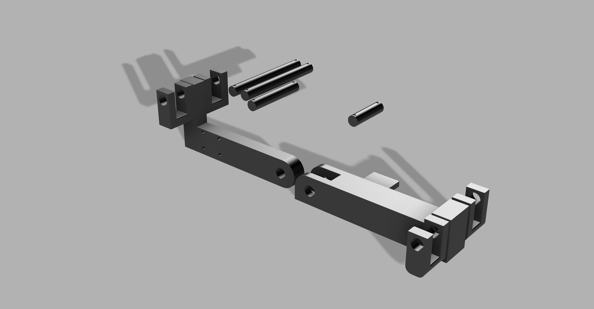
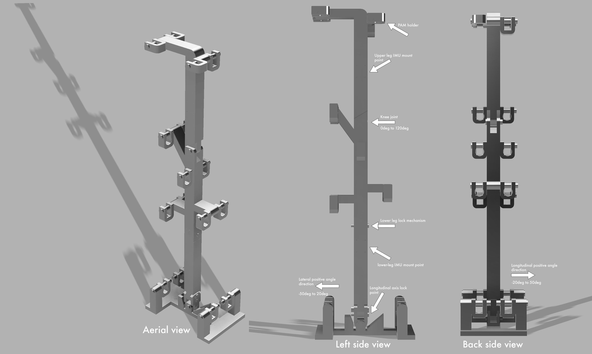

# Lower-leg exoskeleton control and test software
Software used for tests regarding precision of angle control with pneumatical artificial muscle (PAM) for lower-leg exoskeleton proof of concept test stand.
System allows to control each PAM on it's own or just set targeted angle let it do its thing to get to target.

Software can increase or decrease pressure gradually for each muscle.

Targeting algorithms can operate with one muscle where the opposing force is gravity, you can see example in test stand V1 CAD files.
System can also operate with antagonistic muscles in one degree of freedom (DOF) or two DOFs, you can see example in test stand V2 files.

## Table of Contents

## Hardware
Following hardware was utilized with the control software:
- Electronics
  - Arduino Mega 2560 Rev 3
  - 2 MPU6050 as IMUs
  - Adafruit Motor Shield V2 to open and close solenoid valves
  - 12V, 1.2A external power supply for solenoids
    - it should handle up to 6 solenoids open
  - 10 12V, 540mA solenoid valves
- Pressure system
  - 60psi air supply
  - fuel line tubing used for air pressure routing
- Pneumatic Artificial Muscles
  - 3/4" PET expandable braided sleeve
  - 1/4" inner diameter tubing forming the air chamber
  - clamps sealing the tube, sleeve and fuel line together

### Test stand V1
First version of test stand can be used for test up to two antagonistic PAMs that should be 10 inches long. Tests with this stand should be done with `t70` or `t-dyn` commands which will be described in more detail in [functions section](#functions).
Fusion 360 CAD model can be found in [repository](docs/test-stand-v1/cad-files/test_stand_v1.f3d):

[Here is demo of test stand](docs/test-stand-v1/test_stand_v1_run.mp4)

### Test stand V2
Second version test stand is suitable for antagonistic muscle test with 1 DOF to 3 DOFs.
For these test you want to utilize this commands which will be described in [functions section](#functions): `t-ant-dyn`, `t-ant-dyn-2-dof`or `t-ant-dyn-2-dof-v2`.
Fusion 360 CAD models can be found in [repository](docs/test-stand-v2/cad-files):

[Here is demo of test stand](docs/test-stand-v1/test_stand_v1_run.mp4)

## System startup procedure
When software is not ready on micro-controller yet: 
1. Open code in Visual Studio Code
2. Install PlatformIO extension
3. Connect microcontroller to computer
4. Flash micro-controller with software through PlatformIO
5. Continue with [these steps](#when-software-is-already-on-micro-controller)

### When software is already on micro-controller
This is the startup procedure that one should adhere in order to start the system correct way:
1. Connect microcontroller to computer
2. Open monitor in Visual Studio Code extension PlatformIO
3. Wait for startup of system until you see help in monitor
4. Verify whether gyroscope is showing correct values with `dg2` command
5. Power up power supply that should give 12V and 1.2A to the solenoids
6. Close all solenoid valves using `close-all` command
7. Put 60psi air pressure into the system

## Operating the software
After opening monitor in computer that is connected to micro-controller via USB, screen with all available commands should display after init of system.

### Functions
#### Gyroscope
#### Individual muscles
#### Control algorithms
#### Rest

### Data visualization
When terminal is open PlatformIO saves all output that you see in terminal into logs folder in root of the project. If you want to visualize any test data from control algorithm runs look into [Exoskeleton charts repository](https://github.com/matousek11/exoskeleton-charts) where steps to visualize those logs are described.

